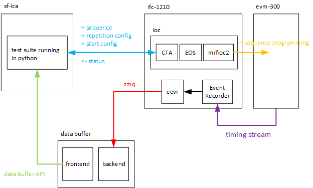

# This folder contains a test suite to automatically test the CTA application.

# What is tested?
The test suite does some basic tests with a simple sequence. However the test suite covers all start and repetition configurations.

# How does the test setup look like?


# What CTA instances can I run the tests on?

| CTA instance | CTA_DEVICE_NAME | EVT_SET_CHAN_NAME |
| :----------: | :-------------: | :---------------: |
| Alvra        | SAR-CCTA-ESA    | SAR-CVME-TIFALL4  |
| Bernina      | SAR-CCTA-ESB    | SAR-CVME-TIFALL5  |
| Maloja       | SAT-CCTA-ESE    | SAT-CVME-TIFALL5  |

# How to run all tests?

```
# load conda environment with cta_lib and evtset modules available
source /opt/gfa/python 3.6
CTA_DEVICE_NAME=<cta device name> EVT_SET_CHAN_NAME=<event set channel name> python -m unittest cta_lib_test
```